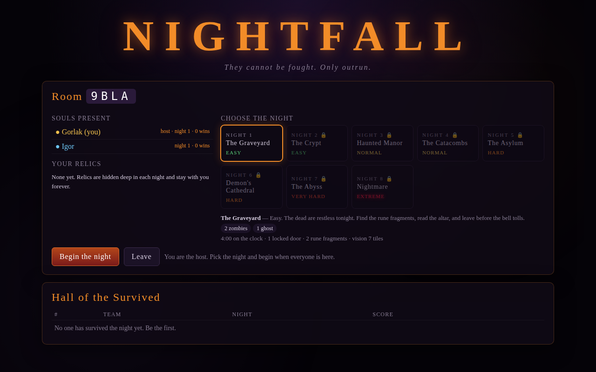

# NIGHTFALL — co-op horror escape

A 2D online multiplayer Halloween game. Up to six players share one dark map,
hunted by monsters they cannot fight. Find the keys, open the doors, collect
the rune fragments, read the altar, and run for the exit before the clock runs
out. If the monsters take all of you, the night wins.



## Play

```bash
npm install
npm start            # http://localhost:3000
```

One player creates a room and shares the 4-letter code (or the link
`/?room=CODE`). The host picks the night and starts. Everyone in the room
plays the same level at the same time.

| Control | Action |
|---|---|
| WASD / arrow keys / touch stick | move |
| walk into a locked door | opens it if the team holds its key |
| E / Space / tap **E** | read the altar (once every fragment is found) |
| stand beside a fallen friend | revive them (2 s) |
| M | mute |

## Features

- **Eight nights, Easy to Extreme.** Each level scales the clock, the map
  size, the number and speed of monsters, the vision radius, how many locked
  doors and rune fragments there are, and how often the jump scares hit.
- **Procedural maps, always solvable.** Rooms, corridors, locked doors and
  keys are generated per game. Keys are always placed on the side of a door
  you can already reach, loops never bypass a lock, and every map is verified
  with a key-aware flood fill before it is served.
- **The mystery.** Rune fragments scattered over the map each carry a rune
  and a mark (I, II, III…). At the altar you offer the runes in order to open
  the exit. A wrong offering costs 15 seconds and wakes an imp. From Night 6
  the altar no longer reminds you of the order.
- **Relics for later nights.** Each night from 2 to 7 hides a relic that
  stays with your name forever: Lantern (vision), Gravekeeper Boots (speed),
  Skeleton Key (force one door per night), Amulet (survive one catch), Seer's
  Eye (keys and fragments glow through the dark), Salt Ward (demons lose you
  faster).
- **Monsters move in lanes.** Every monster moves in straight lines along a
  row or column and only turns at tile centres: zombies patrol, ghosts drift
  through walls toward you, crawlers wait and lunge, imps zig-zag and
  teleport, demons charge the moment you cross their line of sight.
- **Sound that lies to you.** Ambient score and wind, random whispers,
  knocks and creaks, a heartbeat that quickens with proximity, positional
  monster voices panned and attenuated by distance, *phantom* monster sounds
  from empty corridors, and monsters that go silent for a while so they can
  come out of nowhere.
- **Opening cinematic.** A 15-second intro video plays the first time a room
  begins a night, with a Skip button; the server holds the night frozen while
  it runs so nobody loses clock time. The muted version loops behind the lobby.
- **Jump scares.** Random, when you are caught, and when the altar rejects
  you. Screen shake, chromatic flash, scream.
- **Co-op rules.** A caught player goes down; a teammate can revive them.
  The night is lost only when everyone still inside is down. Reaching the
  open exit starts a 15-second countdown for the rest of the team.
- **Hall of the Survived.** A persistent leaderboard (score, team, night) and
  per-name profiles with unlocked nights and relics, stored as JSON on disk.

## Assets

Art comes from four atlases in `public/assets/` (characters with four
facings, props, themed terrain, jump-scare faces), mapped to game sprites by
`public/assets/manifest.json`. Each night has its own terrain theme and
decorations. All audio is synthesized with WebAudio; to add recorded sound,
list files under `audio` in the manifest. Anything not in the manifest keeps
a built-in procedural fallback, so the game runs with no assets at all. See
[`public/assets/README.md`](public/assets/README.md) for the full spec.

## Deploy

[](https://render.com/deploy?repo=https://github.com/gilbertlol/Halloween-gamd)

Any Node host works (Render, Railway, Fly.io, a VPS). The server is a single
process that serves the static client and the WebSocket on the same port.
Config files are included for the three common free tiers:

| Host | File | Notes |
|---|---|---|
| Render | `render.yaml` | free web service; sleeps after 15 min idle, no persistent disk on the free plan |
| Fly.io | `fly.toml` | uses the Dockerfile and a 1 GB volume for scores and relics |
| Railway | `railway.json` | Nixpacks build; add a volume mounted at `/app/data` |

```bash
docker build -t nightfall .
docker run -p 3000:3000 -v nightfall-data:/app/data nightfall
```

Environment:

| Variable | Default | Meaning |
|---|---|---|
| `PORT` | `3000` | HTTP + WebSocket port |
| `DATA_DIR` | `./data` | where `scores.json` and `profiles.json` live |

Put it behind HTTPS (the client switches to `wss://` automatically). Rooms are
in memory, so run one instance, or pin players to one instance with sticky
sessions if you scale out.

## Development

```bash
npm run dev          # restarts on file change
npm test             # map solvability + gameplay bot tests
```

Layout:

```
server/index.js    HTTP static server, WebSocket rooms, lobby, leaderboard
server/game.js     authoritative simulation: players, monsters, doors, puzzle
server/mapgen.js   procedural dungeon generator + solvability verifier
server/levels.js   the eight nights, monster stats, relics
server/store.js    JSON persistence (scores, profiles)
public/client.js   rendering, fog of war, HUD, puzzle, scares, input
public/audio.js    synthesized ambient score, voices, phantoms, stingers
public/assets.js   optional external sprite/audio loader
```

Protocol: clients send `join`, `setLevel`, `start`, `input {dx,dy}`,
`solve {seq}`; the server broadcasts `room`, `start` (map), `state`
(15 snapshots/s with events), and `end`.
